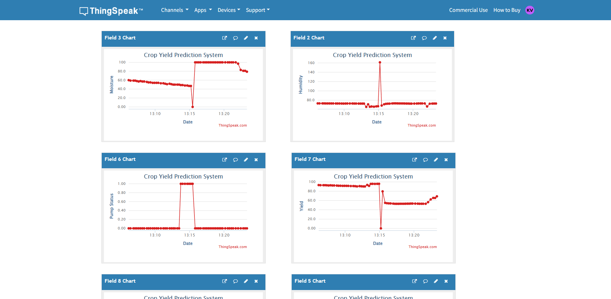

# 🌾 TinyML Crop Yield Prediction — ESP32

Crop yield prediction using **TinyML (TensorFlow Lite)** on an **ESP32 microcontroller** with real-time environmental sensor data, smart irrigation control, and a **React web dashboard** for live monitoring, graph visualization, and CSV data export.

---

## 📌 Project Overview

This project brings AI inference directly to the edge — the trained TensorFlow Lite model runs entirely on the ESP32 without any cloud computation. The ESP32 reads sensor data in real time, predicts crop yield, and makes irrigation decisions autonomously. All data is pushed to **ThingSpeak IoT** and visualized through a custom **web application**.

---

## 🏗️ Project Structure

```
TinyML-Crop-Yield-ESP32/
├── MAIN/                        # ESP32 Arduino firmware
│   ├── CropYieldProject.ino     # Main firmware code
│   └── model.h                  # TFLite model as C array
│
├── TF-model/                    # Machine Learning
│   ├── Crop_yield.ipynb         # Model training notebook
│   ├── dataset.xlsx             # Training dataset
│   ├── crop_yield_model.h5      # Keras model
│   ├── crop_yield_model.tflite  # Converted TFLite model
│   └── scaler.save              # Feature scaler
│
├── WEB APPLICATION/             # React web dashboard
│   ├── src/
│   │   ├── components/          # UI components
│   │   ├── hooks/               # Custom React hooks
│   │   ├── services/            # API services (ThingSpeak)
│   │   ├── utils/               # Utility functions
│   │   └── types/               # TypeScript types
│   └── dist/                    # Production build
│
└── IMAGES/                      # Project screenshots
```

---

## ⚙️ Features

### 🤖 TinyML on ESP32
- TensorFlow Lite Micro model running directly on ESP32
- Predicts crop yield using 15 input features
- Supports crops: **Rice, Wheat, Tomato, Chilli**
- Weather condition encoding: Sunny, Rainy, Cloudy, Windy

### 📡 Sensors & Hardware
- **DHT11** — Temperature & Humidity
- **Soil Moisture Sensor** — Soil moisture level
- **SH1106 OLED Display** — Local display of readings
- **Relay Module** — Automatic irrigation pump control
- **Navigation Buttons** — Crop & weather selection

### 💧 Smart Irrigation
- Automatic pump ON/OFF based on soil moisture
- Irrigation decision fed as input to yield prediction model
- Real-time pump status monitoring

### 🌐 Web Application
- Live sensor data dashboard
- Real-time charts and historical data
- AI prediction panel showing yield output
- Irrigation decision engine visualization
- **Download graphs** as images
- **Export data** as CSV
- Dark/Light mode support
- Built with React + TypeScript + Tailwind CSS + Recharts

### ☁️ Cloud Integration
- Data pushed to **ThingSpeak IoT** platform
- Remote monitoring from anywhere
- Historical data retrieval via ThingSpeak API

---

## 🛠️ Tech Stack

| Layer | Technology |
|---|---|
| Microcontroller | ESP32 |
| ML Framework | TensorFlow Lite Micro |
| Model Training | Python, Keras, TensorFlow |
| Firmware | Arduino (C++) |
| IoT Platform | ThingSpeak |
| Web Frontend | React, TypeScript, Vite |
| UI Styling | Tailwind CSS |
| Charts | Recharts |
| Animations | Framer Motion |

---

## 🚀 Getting Started

### 1. ML Model Training
Open and run the Jupyter notebook:
```
TF-model/Crop_yield.ipynb
```
This trains the model, converts it to TFLite, and generates `model.h` for the ESP32.

### 2. ESP32 Firmware Setup

**Required Libraries (Arduino IDE):**
- TensorFlow Lite Micro
- DHT sensor library
- U8g2 (OLED display)
- ThingSpeak
- ArduinoJson
- WiFi, HTTPClient

**Steps:**
1. Open `MAIN/CropYieldProject.ino` in Arduino IDE
2. Update WiFi credentials:
```cpp
const char* ssid = "YOUR_WIFI_NAME";
const char* password = "YOUR_WIFI_PASSWORD";
```
3. Update ThingSpeak Channel ID and API Key
4. Upload to ESP32

### 3. Web Application Setup

#### Step 1 — Configure API Keys
Open `WEB APPLICATION/src/services/api.ts` and replace the placeholders with your actual keys:

```javascript
// ThingSpeak Configuration
const THINGSPEAK_CHANNEL_ID = 'YOUR_THINGSPEAK_CHANNEL_ID';
const THINGSPEAK_READ_API_KEY = 'YOUR_THINGSPEAK_READ_API_KEY';

// OpenWeather Configuration
const OPENWEATHER_API_KEY = 'YOUR_OPENWEATHER_API_KEY';
```

**How to get API Keys:**

| API | Steps |
|---|---|
| **ThingSpeak Channel ID** | Login to [thingspeak.com](https://thingspeak.com) → My Channels → Your Channel → Channel ID |
| **ThingSpeak Read API Key** | Your Channel → API Keys tab → Read API Key |
| **OpenWeather API Key** | Register at [openweathermap.org](https://openweathermap.org/api) → API Keys → Copy key |

#### Step 2 — Update your location (OpenWeather)
In `api.ts`, update your latitude and longitude:
```javascript
const OPENWEATHER_LAT = 16.815;  // Your latitude
const OPENWEATHER_LON = 81.526;  // Your longitude
```

#### Step 3 — Install and Run
```bash
cd "WEB APPLICATION"
npm install
npm run dev
```
Open `http://localhost:5173` in your browser.

> ⚠️ **Note:** Never share your actual API keys publicly. Keep them only in your local `api.ts` file and do not push them to GitHub.

---

## 📷 Screenshots

| Circuit Diagram | Prediction Output |
|---|---|
|  |  |

| Web App Dashboard | ThingSpeak |
|---|---|
|  |  |

---

## 📊 Model Details

- **Input Features:** 15 (Temperature, Humidity, Soil Moisture, Rain Probability, Pump Status, Irrigation Decision, Crop Type (one-hot), Weather (one-hot))
- **Output:** Predicted crop yield value
- **Model Size:** ~7KB (TFLite) — optimized for microcontroller
- **Tensor Arena:** 20KB RAM on ESP32

---

## 🔌 Hardware Connections

| Component | ESP32 Pin |
|---|---|
| DHT11 Data | GPIO 4 |
| Soil Moisture | GPIO 34 |
| Relay (Pump) | GPIO 26 |
| Next Button | GPIO 18 |
| Select Button | GPIO 19 |
| OLED (I2C SDA) | GPIO 21 |
| OLED (I2C SCL) | GPIO 22 |

---

## 📈 Project Status

- [x] ML model training and conversion to TFLite
- [x] ESP32 firmware with TFLite Micro inference
- [x] Sensor integration (DHT11, Soil Moisture)
- [x] OLED display output
- [x] ThingSpeak cloud integration
- [x] Web application with live dashboard
- [x] Graph download and CSV export
- [ ] Hardware enclosure (In Progress)
- [ ] Mobile app (Planned)

---

## 📄 License

This project is licensed under the **MIT License** — see the [LICENSE](LICENSE) file for details.

---

## 👨‍💻 Author

**Karthikeya** — [@karthikeya247](https://github.com/karthikeya247)